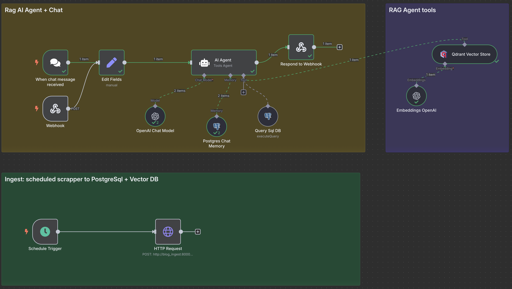

# n8n-Getting-Started: n8n
This example shows how to run a local **n8n service** using docker-compose.

## Prerequisites
    - [Git](https://github.com/)
    - [Docker](https://docs.docker.com/engine/install/)
    - [Docker-Compose](https://docs.docker.com/compose/install/)

## Instructions
### Step 1. Clone the repo
Clone the repo to your local machine by running the following command:

```bash
git clone git@github.com:bitovi/n8n-getting-started.git
```

### Step 2. Create your .env file
Copy the example environment file to .env:

```bash
cp .env-example .env
```

### Step 3. Start the service
Start the docker-compose service by running the following command:

```bash
docker-compose up --build
```

### Step 4. Validate the service is running
Watch the logs to ensure the service is running:

```bash
docker-compose logs -f
```

The tail of the logs should show the following message:

```bash
Editor is now accessible via:
https://localhost:5678/
```

### Step 5. Access the service
Open a browser and navigate to the following URL: [https://localhost:5678/](https://localhost:5678/)

Note: we use self-signed certificates for local development to enable Oauth callbacks for 3rd party integrations, e.g. Slack.

## Next Steps
This repo contains folders with additional docker-compose files for other services that can be run in conjunction with n8n.

To use these additional services use the following command:
```bash
docker-compose -f docker-compose.yml -f <Service>/docker-compose.yml up
```

Where `<Service>` is the name of the service you want to run. For example, to run n8n with Postgres, use the following command:

```bash
docker-compose -f docker-compose.yml -f Postgres/docker-compose.yml up
```

For convenience, a wrapper script has been added to make this less clunky. The `./up` command will startup n8n and takes a list of additional services to run with it.

```bash
./up Postgres
```

To start the full Bitovi stack (n8n, Postgres, Qdrant, Adminer) in one command, use:

```bash
./up bitovi
```

## Adminer
Adminer is a database management tool that can be used to manage the databases used by n8n. To access Adminer, navigate to the following URL: [http://localhost:8080/](http://localhost:8080/)

The credentials are pulled directly from the database environment variables. 
For example, if you are using Postgres, the credentials are:

```bash
System: Postgres
Server: pg-n8n
Username: n8n
Password: password
Database: n8n
```

## Blog Scraper, Ingestion & Vector Search Architecture



This project includes a modern microservice architecture for automated blog ingestion and vector search, orchestrated by n8n:

- **n8n Workflow**: Triggers the ingestion process on a schedule using a webhook call to the FastAPI service's `/ingest` endpoint.
- **FastAPI Microservice**: Handles scraping Bitovi blog articles, extracting clean text and metadata, and storing them in Postgres.
- **Vector Database (Qdrant)**: After ingestion, the service generates embeddings for each article and inserts them into Qdrant for semantic search and RAG workflows.
- **Postgres**: Stores structured article metadata and content for analytics and backup.

**Key Features:**
- Automated, scheduled ingestion via n8n
- Clean text extraction, metadata parsing, and polite scraping
- Embedding generation and vector storage in Qdrant
- FastAPI `/ingest` endpoint for triggering the pipeline
- Scalable, production-ready Docker Compose setup

**Setup instructions will be added here once the service is implemented.**

## Conclusion
Have fun n8n-ing!
